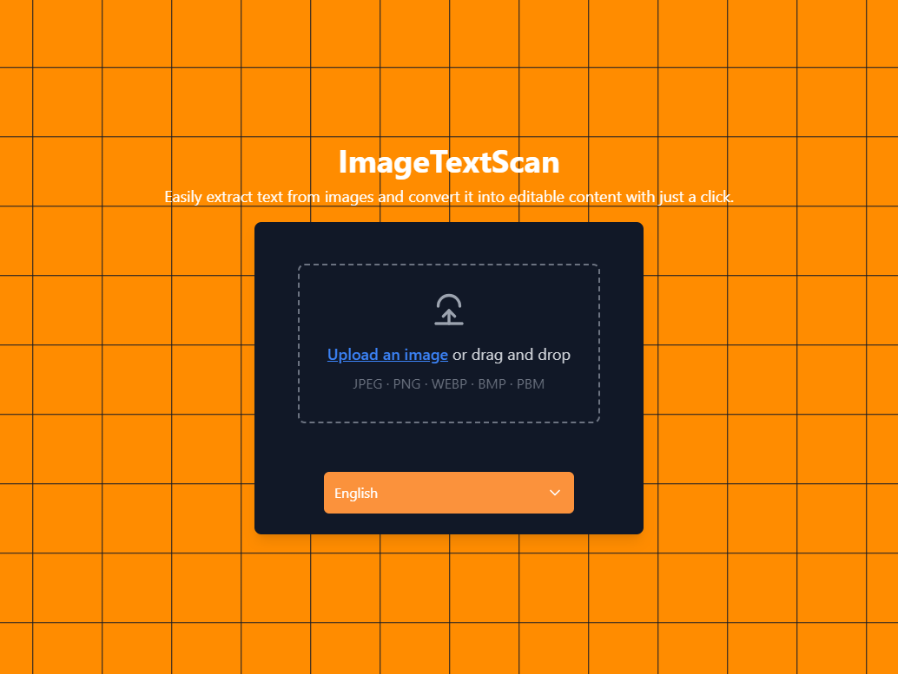

# Text to Image

## Overview
Text to Image is a web application that allows users to easily extract and copy text from any image using Optical Character Recognition (OCR). The application leverages Tesseract.js to process and recognize text in various languages, providing a simple and user-friendly interface to upload images and convert them into editable text.

## Features
- Upload images in various formats (JPEG, PNG, WEBP, BMP, PBM).
- Select multiple languages for text recognition.
- Real-time progress tracking of OCR extraction.
- Display of extracted text in a user-friendly format.
  
## Tech Stack
- **React**: Frontend framework.
- **Tesseract.js**: OCR library for text extraction.
- **TailwindCSS**: Utility-first CSS framework for styling.
- **TypeScript**: Typed JavaScript for enhanced developer experience.

## Installation
Follow these steps to set up and run the project locally:

1. Clone the repository:
   ```bash
   git clone <repository-url>
   ```

2. Navigate to the project directory:
   ```bash
   cd text-to-image
   ```

3. Install the dependencies:
   ```bash
   npm install
   ```

4. Start the development server:
   ```bash
   npm run start
   ```

5. Open your browser and visit:
   ```
   http://localhost:3000
   ```

## Usage
1. **Upload an Image**: Click on the file uploader or drag and drop your image into the designated area.
2. **Select Language(s)**: Choose one or more languages for OCR from the dropdown.
3. **Extract Text**: Press the Extract Text button to begin the OCR process.
4. **View Text**: The extracted text will be displayed below, along with the progress of the extraction.

## Components
- **FileUploader**: Component for uploading and handling image files.
- **LanguageSelector**: Dropdown to select the language(s) for OCR.
- **ProgressBar**: Displays the current progress of the OCR process.
- **TextDisplay**: Displays the extracted text from the image.
- **Pattern**: Background pattern component for styling.

## Scripts
- npm run start: Starts the development server.
- npm run build: Builds the app for production.

## License
This project is licensed under the MIT License. See the LICENSE file for details.


## Acknowledgements
- **Tesseract.js**: For making OCR possible in the browser.
- **React**: For providing a solid foundation for building user interfaces.
- **TailwindCSS**: For its powerful and flexible styling system.
